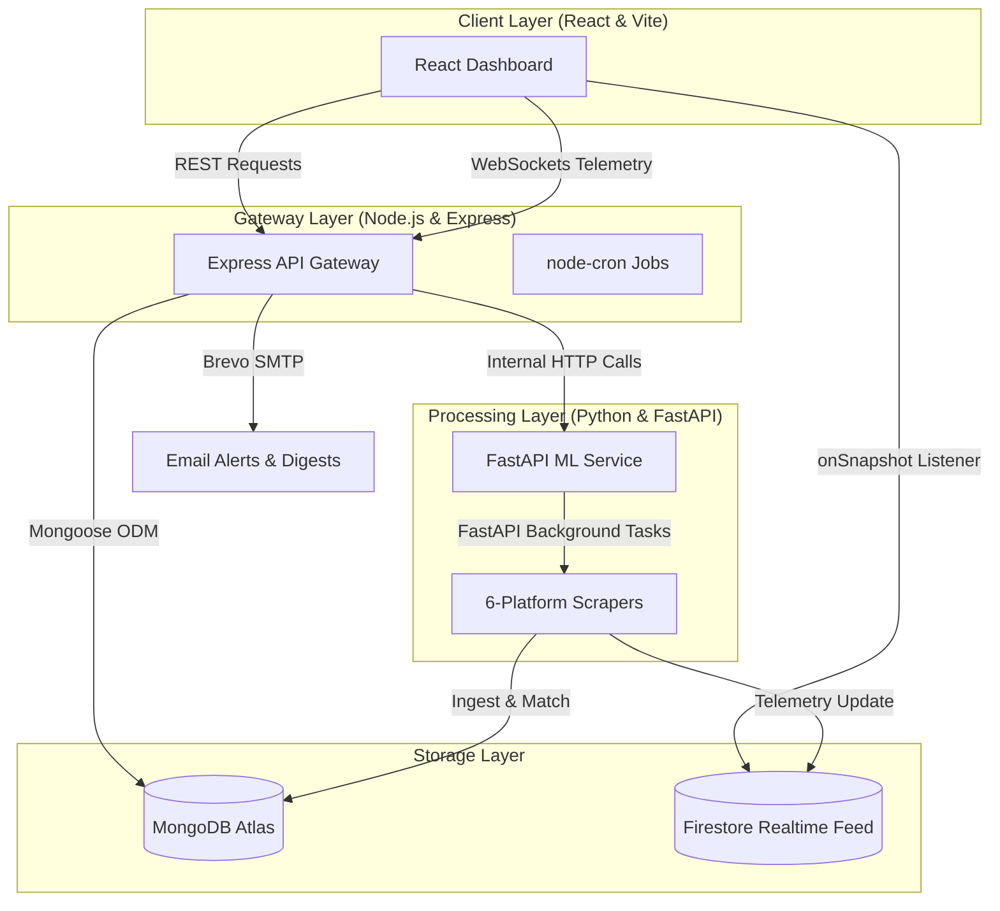

# Architecture Overview

## Navigation

- [API Reference](API.md)
- [Database Schemas](Database.md)
- [Deployment Guide](Deployment.md)
- [Scraper System](Scraper-System.md)

---

## System Map

The following diagram illustrates the relationship between the React frontend, the Express API gateway, the FastAPI ML pipeline, our primary database, and the real-time notification layer:

---

## Repository Layers

| Layer | Responsibility | Representative Files |
| --- | --- | --- |
| **Client Frontend** | UI layouts, responsive settings, role-based workflows, analytics charts, and real-time feeds. | `client/src/App.jsx`, `client/src/pages/`, `client/src/components/` |
| **API Gateway** | Route mapping, token verification, business logic controllers, PDF generation, and alert triggers. | `server/src/index.js`, `server/src/routes/`, `server/src/controllers/`, `server/src/services/` |
| **Data Persistence** | MongoDB model definitions, indexes, schema schemas, and relationships. | `server/src/models/` |
| **ML Engine** | Media fingerprinting (OpenCV pHash), ORB+RANSAC homography, and Google Cloud Vision AI validation. | `ml-service/fingerprint/`, `ml-service/matching/` |
| **Ingestion Pipeline** | Multi-platform scrapers, request routing, keyword suggestion logic, and API wrappers. | `ml-service/scraper/` |

---

## Frontend Structure

The frontend is a React + Vite SPA using modular routing and directory separation:
- `src/app/`: Unified routing configuration and authentication/context providers.
- `src/pages/`: Page-level components corresponding to navigation items (Dashboard, Asset Library, Livestream Scanner, Threat Analytics, Team Settings).
- `src/components/`: Reusable interface widgets, alerts, charts, and layout frames.
- `src/services/`: HTTP axios wrappers and socket.io client connections.
- `src/store/`: Central state configurations.

---

## Backend Structure

The backend server exposes the REST API under `/api` and boots background services:
- `/auth`: Handles user registration, Google One-Tap authentication, and token refreshes.
- `/organization`: Controls team invitations, member management, and role-based permissions (`admin`, `analyst`, `legal`).
- `/assets`: Video/image upload logic and Gemini keyword suggestions.
- `/scans`: Livestream and scheduled scanning task runners.
- `/violations`: Detailed similarity calculations, screenshots, and Gemini-powered DMCA legal notice generation.
- `/alerts`: Notification logs and inbox read status controllers.
- `/reports`: High-fidelity PDF reporting using headless Chrome (Puppeteer).
- `/digest`: Cron-job.org webhook callbacks for sending weekly updates.

During boot, the server spins up a standard node-cron scheduler to handle weekly digest preparation.

---

## Data Flow

1. **Asset Ingestion**: An analyst uploads a reference match highlight or image. The backend saves it to Cloudinary, sends it to the ML service to calculate its pHash/flipped-pHash footprint, and stores the resulting "Content DNA" in MongoDB.
2. **Scheduled/Manual Scans**: The server triggers a scan task on the ML service for a set of target keywords (optionally expanded via the Google Translation API).
3. **Scraping & Matching**: The ML service scrapes candidate video metadata and frames from the 6 platforms. Candidate images are compared against the reference DNA. Flipped pHash is checked for horizontal mirroring. Borderline cases are validated via keypoint homography (ORB) and Google Cloud Vision AI logo/label analysis.
4. **Violation Registration**: High-confidence violations are written to MongoDB. The server emits real-time events via Socket.io and Firestore to update dashboards and pushes transactional emails via Brevo if alerts are enabled.
5. **DMCA Takedown**: Legal team members review violation evidence, edit the auto-generated DMCA notice citing BCCI/ICC broadcast rights, and download the compiled evidence ZIP package for instant platform submission.
