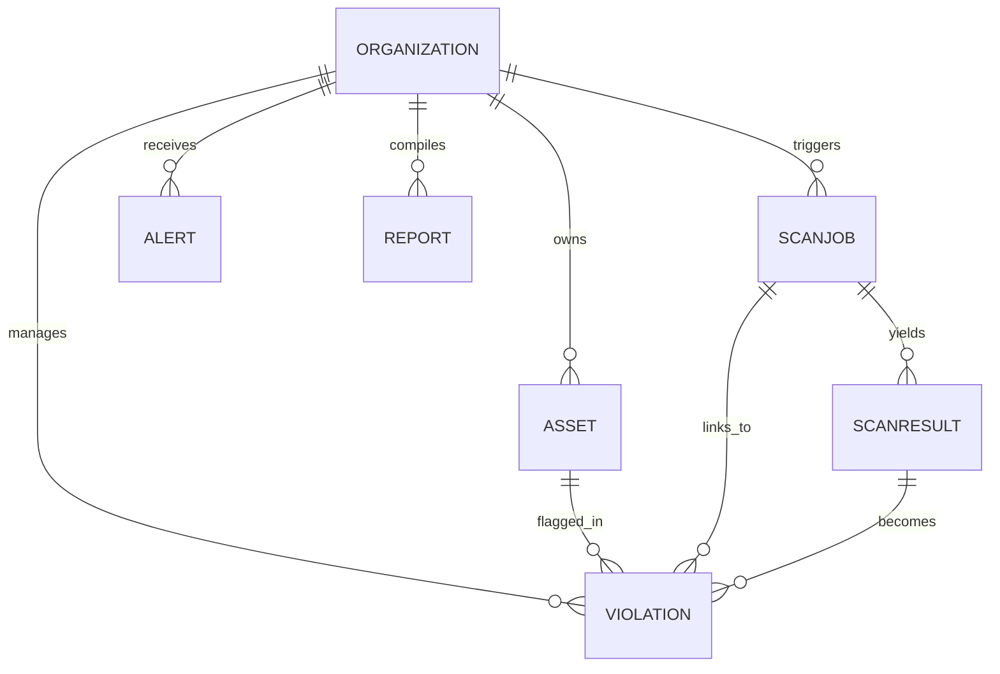

# Database Documentation

## Navigation

- [Architecture Overview](Architecture.md)
- [API Reference](API.md)
- [Deployment Guide](Deployment.md)
- [Scraper System](Scraper-System.md)

---

## Overview

SportShield uses MongoDB Atlas as its primary datastore, mapped using Mongoose schemas. Real-time telemetry scan events utilize Firebase Firestore alongside standard MongoDB tracking.

## Collections

| Collection | Model Name | Responsibility | Key Notes |
| --- | --- | --- | --- |
| `organizations` | `Organization` | Access credentials, member lists, and configuration preferences. | Passwords are hashed with bcrypt. Supports sub-user arrays with role designations. |
| `assets` | `Asset` | Reference video and image fingerprint registries. | Stores standard and flipped pHash DNA vectors and lists of authorized domains. |
| `scanjobs` | `ScanJob` | Status registry for active, completed, and failed scrapes. | Tracks search keywords, platform configurations, and progress metrics. |
| `scanresults` | `ScanResult` | raw scraped match records flagged for similarity. | Stores candidate URLs, confidence ratings, and platform channels. |
| `violations` | `Violation` | Confirmed infringements verified by our ML pipeline. | Tracks resolution status, similarity breakdowns, and DMCA notice versions. |
| `alerts` | `Alert` | In-app inbox messages for high-confidence match triggers. | Employs status indicators for read state and severity classifications. |
| `reports` | `Report` | Registry for generated PDF analysis documents. | Stores URLs for PDFs generated using Puppeteer. |

---

## Entity Relationships

The following entity-relationship diagram maps how our MongoDB collections connect:

---

## Schema Details

### 1. Organization (`Organization`)
- `orgName`: Broadcaster or organization name.
- `email`: Primary account email (verified).
- `password`: Hashed credentials.
- `plan`: Subscription tier (`free`, `growth`, `enterprise`).
- `members`: Sub-user membership array:
  - `email`: Invitee address.
  - `role`: Permission level (`admin`, `analyst`, `legal`).
  - `inviteStatus`: Join state (`pending`, `joined`).
  - `joinedAt`: Timestamp when the user accepted their invitation.
- `notificationPrefs`: Alerting thresholds (e.g., minimum confidence to trigger emails).

### 2. Asset (`Asset`)
- `title`: Human-readable identifier.
- `description`: Context information.
- `referenceUrl`: Link to raw highlight video stored on Cloudinary.
- `fingerprints`: DNA maps representing video frames (perceptual hash strings).
- `fingerprintsMirrored`: Flipped pHash vectors used to catch horizontally mirrored videos.
- `licensedDomains`: Array of domains authorized to distribute this media.
- `licensedPartners`: List of authorized syndication partner names.

### 3. ScanJob (`ScanJob`)
- `keywords`: Search queries passed to scrapers.
- `platforms`: Selected channels to search (e.g., `["youtube", "telegram"]`).
- `status`: Execution state (`queued`, `scanning`, `completed`, `failed`, `stopped`).
- `progress`: Percentage indicator of completion.
- `startedBy`: User reference who launched the scan.

### 4. Violation (`Violation`)
- `assetId`: Reference to the original protected asset.
- `scanJobId`: Reference to the execution scan task.
- `url`: Location of the infringing material.
- `platform`: Host platform (`youtube`, `x`, `telegram`, `web`, `twitch`, `kick`).
- `status`: Workflow phase (`OPEN`, `REPORTED`, `RESOLVED`, `LICENSED`).
- `similarityScore`: Overall match rating (e.g., `92%`).
- `similarityMetrics`: Score breakdown:
  - `phashScore`: Perceptual hash correlation percentage.
  - `colorScore`: Frame color histogram similarity rating.
  - `orbConfidence`: Homographic keypoint alignment status.
  - `visionVerified`: Cloud Vision AI overlap confirmation.
- `dmcaNotice`: Custom Gemini-drafted notice text.
- `screenshotUrl`: Saved evidence JPEG location.
