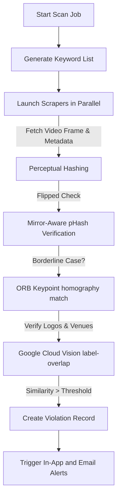

# Scraper Pipeline Documentation

## Navigation

- [Architecture Overview](Architecture.md)
- [API Reference](API.md)
- [Database Schemas](Database.md)
- [Deployment Guide](Deployment.md)

---

## Overview

SportShield uses a high-throughput, platform-agnostic scraping architecture located within `ml-service/scraper/`. It searches, crawls, and aggregates media streams and highlights across six major platforms to discover potential copyright violations.

---

## Supported Platforms

| Platform | Scraper Strategy | Fallback Protocol |
| --- | --- | --- |
| **YouTube** | Searches matches using the **YouTube Data API v3** if `YOUTUBE_API_KEY` is configured. | Parses search result page HTML using selectors when API keys are absent. |
| **X (Twitter)** | Crawls search result streams for media embeds and video feeds. | Employs user-agent rotation and proxy retry profiles. |
| **Telegram** | Queries public web-previews of Telegram channels (`t.me/s/...`) to locate stream leaks. | Filters links to capture matches containing live stream references. |
| **Web** | Performs search queries using the **Google Custom Search Engine (CSE) API**. | Falls back to crawling DuckDuckGo search result HTML structures. |
| **Twitch** | Scrapes live stream directories and captures active streams using public index APIs. | Integrates fallback streaming URL resolutions. |
| **Kick.com** | Queries live stream indices using localized browser selectors to parse active RTMP channels. | Extracts live playback URLs for diagnostic capture. |

---

## Detection & Matching Workflow

---

## Running and Triggering Scans

### 1. Manual Scans
Users can trigger real-time scanning jobs through the client portal or via the API:
- `POST /api/scans/start`: Initializes scans for target keywords across chosen platforms.

### 2. Scheduled Scans
The ML service runs scheduled verification sweeps:
- `POST /api/scans/run-scheduled`: Called by backend schedulers to refresh monitoring logs for active assets.

---

## Pipeline Best Practices & Maintenance

- **User-Agent Rotation**: All HTML-based scrapers utilize dynamic headers to prevent scraper blocks and rate-limiting.
- **Isolate Scrapers**: Scraper connectors are isolated; failures or markup changes in one platform (e.g., Kick) do not block searches on others.
- **API Prioritization**: Web search and YouTube scrapers default to official APIs for reliability, using HTML parsers only when credentials are not supplied.
- **Configurable Limits**: You can adjust scraper depth (`YOUTUBE_MAX_RESULTS`, `WEB_MAX_RESULTS`) and delay times via `ml-service/.env`.
